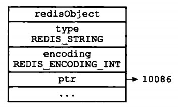
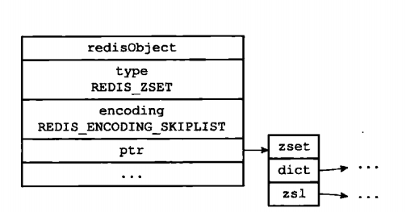
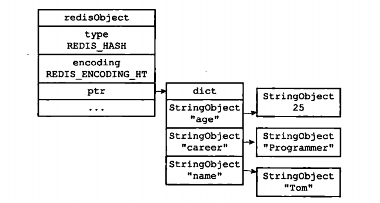

### 一、Redis之对象

Redis并没有直接使用这些基本数据结构，而是基于这些数据结构创建了一个对象系统，这个系统包含字符串对象、列表对象、哈希对象、集合对象和有序集合对象这五种类型，接下来我们了解一下这些对象。

1、对象的数据结构
``` 
typedef struct redisObject {
    // 类型
 unsigned type:4;
    // 编码
 unsigned encoding:4;
    // 对象最后一次被访问的时间
 unsigned lru:REDIS_LRU_BITS;
 // 计数器
 int refcount;
    // 指向对象的底层数据结构
 void *ptr;
} robj;
```
类型：

``` 

// 对象类型
#define REDIS_STRING 0      //字符串对象
#define REDIS_LIST 1        //列表对象
#define REDIS_SET 2         //集合对象
#define REDIS_ZSET 3        //有序集合对象
#define REDIS_HASH 4        //哈希对象

```
编码：
``` 
#define REDIS_ENCODING_RAW 0     /* Raw representation */
#define REDIS_ENCODING_INT 1     /* Encoded as integer */
#define REDIS_ENCODING_HT 2      /* Encoded as hash table */
#define REDIS_ENCODING_ZIPMAP 3  /* Encoded as zipmap */
#define REDIS_ENCODING_LINKEDLIST 4 /* Encoded as regular linked list */
#define REDIS_ENCODING_ZIPLIST 5 /* Encoded as ziplist */
#define REDIS_ENCODING_INTSET 6  /* Encoded as intset */
#define REDIS_ENCODING_SKIPLIST 7  /* Encoded as skiplist */
#define REDIS_ENCODING_EMBSTR 8  /* Embedded sds string encoding */

```

2、redis的五大对象

（1）字符串对象（REDIS_STRING）


（2）列表对象（REDIS_LIST）


压缩列表对象

（3）集合对象（REDIS_SET）

（4）有序集合（REDIS_ZSET）

（5）哈希对象（REDIS_HASH）



3.对象共享
（这块萝卜丝说过，大家可以参考）

4.内存回收机制 

c不具备内存回收功能，Redis在自己对象机制上实现了引用计数功能，达到内存回收目的。每个对象的引用计数值在redisObject中的（int refcount;）来记录。

具体规则：

- 当创建一个对象或者该对象被重新使用时，它的引用计数++；
- 当一个对象不再被使用时，它的引用计数--；
- 当一个对象的引用计数为0时，释放该对象内存资源（摘自于《redis的设计与实现》,但是在源码中可见，当refcount为1是就进行了释放的相关判断）。

5.对象时空转长

redisObject 中lru属性用来计算空转时长。redis 的object idletime 命令可知给定键的“空转时长”，是用当前时间减去键的lru时间计算得出的。

键的空转时长还有一个作用，如果服务器打开了maxmemory选项，并且服务器用于回收内存的算法是volatile-lru 或者 allkeys-lru，那么当服务器占用的内存数超过了maxmemory选项所设置的上限值时，空转时长较高的那部分键会优先被服务器释放，从而回收内存。

``` 
127.0.0.1:6379> set key1 name
OK
#等一小会
127.0.0.1:6379> object idletime key1
(integer) 16
#等一大会
127.0.0.1:6379> object idletime key1
(integer) 258

当该值是0时，表示该键出于活跃状态
```

### 二、Redis通讯协议

1.发送一个命令，处理的几大步骤：

（1）client连接管理；

（2）解析client的请求；

（3）发送回复内容给client

源码内容较多，可参考下面这个
https://blog.csdn.net/hangbo216/article/details/53909302

2.通讯协议格式描述：
``` 
    单行字符串 以 + 符号开头；
    
    多行字符串 以 $ 符号开头，后跟字符串长度；
    
    整数值 以 : 符号开头，后跟整数的字符串形式；
    
    错误消息 以 - 符号开头;
    
    数组 以 * 号开头，后跟数组的长度。
```


3.小demo，看一下

``` java

public class Test3 {
    public static void main(String[] args) throws Exception {
        // socket
        Socket socket = new Socket("127.0.0.1", 6379);

        // oi流
        OutputStream os = socket.getOutputStream();
        InputStream is = socket.getInputStream();

        // 向redis服务器写
        os.write("get hello\r\n".getBytes());

        //从redis服务器读,到bytes中
        byte[] bytes = new byte[1024];
        int len = is.read(bytes);

        // to string 输出一下
        System.out.println(new String(bytes,0,len));
    }
}
    //输出结果
    //$-1
    
public class Test2 {
    public static void main(String[] args) throws Exception {
        // socket
        Socket socket = new Socket("127.0.0.1", 6379);

        // oi流
        OutputStream os = socket.getOutputStream();
        InputStream is = socket.getInputStream();

        // 向redis服务器写
        os.write("set test hello\r\n".getBytes());

        //从redis服务器读,到bytes中
        byte[] bytes = new byte[1024];
        int len = is.read(bytes);

        // to string 输出一下
        System.out.println(new String(bytes,0,len));
    }
}
//输出结果：
//+OK

命令换换：HGETALL hobj 
返回结果：
*4    数组长度
$4    字符长度
name
$5
cheng
$3
age
$2
12
```


