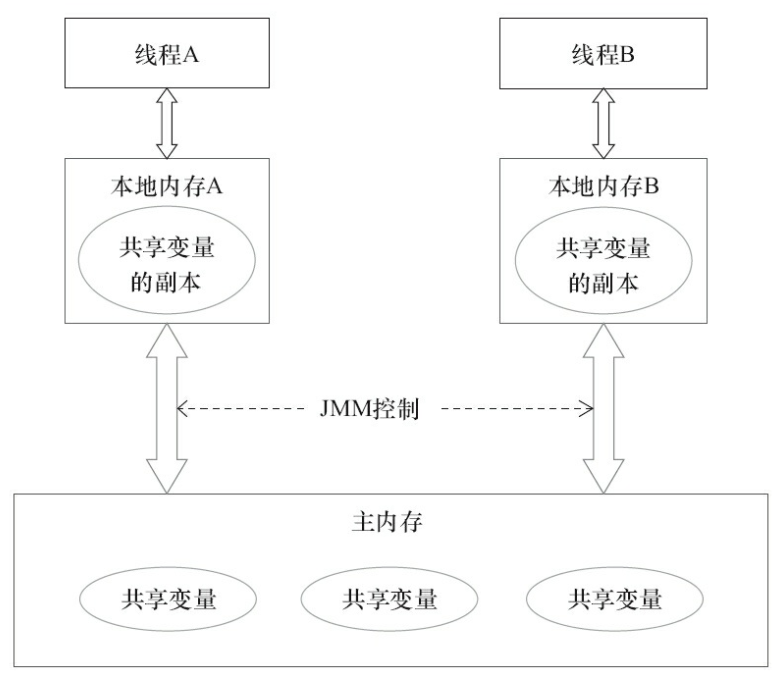

##Volatile关键词

###Java内存模型
在了解这个关键词之前，我们先了解一下JMM，Java内存模型。

Java线程之间的通信由Java内存模型控制，JMM决定一个线程对共享变量的写入何时对另一个线程可见。从抽象的角度来看，JMM定义了线程和主内存之间的抽象关系：线程之间的共享变量存储在主内存（Main Memory）中，每个线程都有一个私有的本地内存（Local Memory），本地内存中存储了该线程以读/写共享变量的副本。本地内存是JMM的一个抽象概念，并不真实存在。它涵盖了缓存、写缓冲区、寄存器以及其他的硬件和编译器优化。Java内存模型的抽象示意如下图所示。



java内存模型规定了所有的变量都存储在住内存。每条线程还有自己的工作内存，线程的工作内存中保存了被改线程使用到的变量的主内存副本拷贝。线程对变量的所有操作都必须在工作内存中进行，而不能直接读写主内存中的变量。不同线程之间也无法直接访问对方工作内存中的变量，线程间变量传递均需要通过主内存来完成。当多个线程操作的变量涉及到同一个主内存区域，将可能导致各自的工作线程数据不一致，这样就导致变量同步回主内存的时候可能冲突导致数据丢失。

说完了，我们先来看一个小例子。
```java
public class Test4 {
    public static int num = 0;
    //使用CountDownLatch来等待计算线程执行完
    static CountDownLatch countDownLatch = new CountDownLatch(30);
    public static void main(String []args) {
        //开启30个线程进行累加操作
        for(int i=0;i<30;i++){
            new Thread(){
                @Override
                public void run(){
                    for(int j=0;j<10000;j++){
                        //自加操作
                        num++;
                    }
                    countDownLatch.countDown();
                }
            }.start();
        }
        //等待计算线程执行完
        countDownLatch.await();
        System.out.println(num);
    }
}

//得出的结果是：161976
//期望得到的结果是：300000
```
分析可知：
假设此时有两个线程，线程1修改了num值，但是并没有来的及将本地缓存的值更新到共享缓存中，这是线程2读取了num值并做修改更新了共享缓存，造成了数据不一致没有达到期望值。这时候要引进一下`volatile`关键词了。

###volatile的作用：

- 修饰某个变量，保证变量对所有的线程可见

- 禁止指令重排序优化

####怎么保证可见性：

JMM通过控制主内存与每个线程的本地内存之间的交互，控制内存可见性。通俗说，多线程访问下，volatile写操作的同时将本地内存的值更新到主内存，volatile读操作，也是从主内存读取数据。

修改一波，使用`volatile`，保证num对所有线程可见。

``` 
//使用volatile关键字
 public static int num = 0;

 public static volatile int num = 0;
 
 此时得到的结果：167665

```

思考一波，为什么保证了num值对线程可见还是不能得到期望值。

我们知道并发编程中会出现三个问题：
- 原子性
- 可见性
- 顺序性

我们通过`volatile`保证了`可见性`，但是在上述代码中volatile并不能保证它的`原子性`。

看下`原子性`：对于原子就是不可再分割的粒子，对于原子操作就是不可中断的一个或一系列操作。

对于num++来说，是三个步骤：先读取num值，再执行++操作，最后在存储最终结果，不是原子操作。

最后使用原子操作类保证`原子性`的：
```java
public class Test4 {
   
    //使用原子操作类
    public static AtomicInteger num = new AtomicInteger(0);
    //使用CountDownLatch来等待计算线程执行完
    static CountDownLatch countDownLatch = new CountDownLatch(30);
    public static void main(String []args) throws InterruptedException {
        //开启30个线程进行累加操作
        for(int i=0;i<30;i++){
            new Thread(){
                @Override
                public void run(){
                    for(int j=0;j<10000;j++){
                        //原子性的num++,通过循环CAS方式
                        num.incrementAndGet();
                    }
                    countDownLatch.countDown();
                }
            }.start();
        }
        //等待计算线程执行完
        countDownLatch.await();
        System.out.println(num);
    }
}
//结果：300000
```
####为什么AtomicInteger可以保证原子性？看源码么

简单看下
```
public final int incrementAndGet() {
        return unsafe.getAndAddInt(this, valueOffset, 1) + 1;
    }

 public final int getAndAddInt(Object var1, long var2, int var4) {
        int var5;
        do {
            var5 = this.getIntVolatile(var1, var2);
        } while(!this.compareAndSwapInt(var1, var2, var5, var5 + var4));

        return var5;
    }

```
可以看到，实现了一个CAS来实现原子操作

留下了一个重排序的问题，下次再说。


